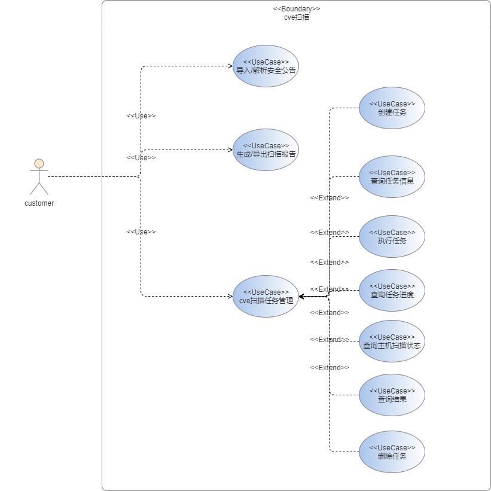
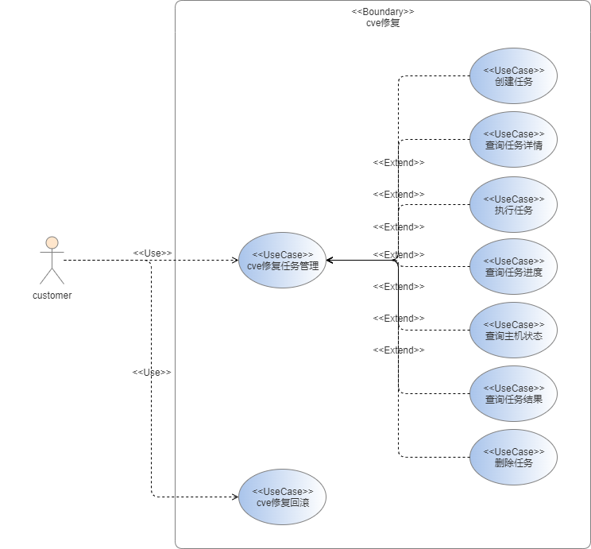
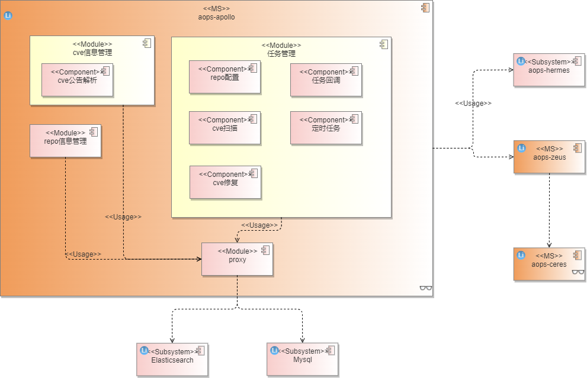

# 1、特性描述

​	社区会经常披露一些安全漏洞，如果不能及时修复这些漏洞，可能会对系统造成影响。而在一个集群下，当机器数量过多时，逐个修复cve显得不现实。因此A-Ops运维工具提供了cve巡检&修复功能，该功能能够定时扫描纳管主机的cve信息，并及时呈现给用户，用户可以在web界面上进行这些cve的处理。用户能够及时修复影响较大的cve，也能够评审cve的影响程度决定是否马上修复，当cve修复后出现问题也能够进行回退。

## 1.1、受益人

| 角色     | 角色描述                                               |
| :------- | :----------------------------------------------------- |
| 运维人员 | 负责机器运维管理的人员                                 |
| 普通用户 | 个体用户，注册服务后，依赖于该系统对自己的机器进行监控 |

## 1.2、依赖组件

| 组件          | 组件描述                        | 可获得性                        |
| :------------ | :------------------------------ | :------------------------------ |
| elasticsearch | 分布式数据库                    | 官网rpm包安装                   |
| mysql         | 关系型数据库                    | 使用openEuler repo源yum install |
| aops-vulcanus    | A-Ops工具包                     | 使用openEuler repo源yum install |
| aops-zeus  | A-Ops资产管理模块，添加主机需要 | 使用openEuler repo源yum install |
| aops-ceres | 部署在客户端的服务，执行相应命令 | 使用openEuler repo源yum install |

## 1.3、License

Mulan V2

# 2、需求场景分析

## 2.1、上下文/USE-CASE视图

### 2.1.1、repo设置Use Case

- 要完成cve管理首先需要update repo源的管理，基于openEuler的安全策略：cve在修复后会以安全公告以及update版本的形式对外发布，所以这里需要用户配置openEuler对应版本的update repo源，随后才能通过yum命令获取到当前节点存在的cve信息，以及做进一步的cve修复操作。

- 可以识别出用户需要的功能为：

  - repo源管理，用户能够查看、添加、更新、删除其名下的repo源。

  - 配置repo源，用户可以选择给指定的主机配置指定的repo源，这里涉及到任务的管理。

  - 下载repo源模板，为方便用户添加repo，专门提供了repo模板。


### 2.1.2、cve扫描Use Case

- 当配置好相应的repo源后，执行一种指定的cve扫描方式（如根据openEuler的安全公告来识别当前管理主机已安装软件包的cve信息），即可获取到某指定主机的cve信息。
- 可以识别出用户需要的功能为：
  - 安全公告导入，首先需要一份全量cve信息数据库，后续才能关联这些信息。
  - cve扫描，这里涉及到扫描任务的管理（创建、执行、进度查询、结果查看）。
  - 扫描报告导出，方便用户查看更详细的信息。



### 2.1.3、cve信息查询Use Case

- 扫描出来的信息需要清晰直观地呈现给用户，因此要提供给用户一个查询的界面。并且在上面能够做一些筛选和评审。
- 可以识别出用户需要的功能为：
  - cve信息查询，包括cve信息总览、cve列表、cve详情等
  - 主机维度查询，获取主机列表，获取主机的cve信息等。
  - cve评审状态设置，用户可已设置cve状态，如标志某cve已review，或可忽略。


### 2.1.4、cve修复Use Case

- 当用户完成cve扫描、评审后，需要对识别出来cve的主机进行修复，后端通过aops的管理组件下发命令到agent端的方式来执行修复任务，同时需要支持cve修复回滚。

- 可以识别出用户需要的功能为：

  - cve修复任务管理，如执行cve扫描，查看cve修复任务的详情，查询具体某个cve的进度，状态查询，结果查询，执行cve修复回滚等。

  - cve修复回滚，当修复后存在问题时，需要及时回滚。




## 2.2、Story分解

| Use Case    | Story                         | 模块         | 实现版本 | 说明 |
| ----------- | ----------------------------- | ------------ | -------- | ----------- |
| repo设置    | 查看repo源                    | repo信息管理 | 22.03 |  |
|             | 添加repo源                    | repo信息管理 | 22.03 |  |
|             | 更新repo源                    | repo信息管理 | 22.03 |  |
|             | 删除repo源                    | repo信息管理 | 22.03 |  |
|             | 创建配置repo源任务          | 任务管理     | **22.12** | 不再需要pb |
|             | 查询配置repo源任务          | 任务管理     | 22.03 |  |
|             | 执行配置repo源任务          | 任务管理     | **22.12** | 由ansible的执行方式修改为agent端执行 |
|             | 查询配置repo源任务进度      | 任务管理     | 22.03 |  |
|             | 查询配置repo源任务结果      | 任务管理     | 22.03 |  |
|             | 删除配置repo源任务      | 任务管理     | 22.03 |  |
|             | 下载repo源模板                | repo信息管理 | 22.03 |  |
| cve扫描     | 导入/解析安全公告        | cve信息管理  | **22.12** | 支持解析不受影响cve |
|             | 创建cve扫描任务             | 任务管理     | **22.12** | 显式创建cve扫描任务，并存储任务信息 |
|             | 查询cve扫描任务             | 任务管理     | **22.12** | 查询cve扫描任务详情，扩展task_type |
|             | 执行cve扫描任务             | 任务管理     | **22.12** | 由ansible的执行方式修改为agent端执行 |
|             | 查询cve扫描任务进度         | 任务管理     | **22.12** | 任务进度查询扩展（支持cve_scan） |
|             | 查询cve扫描结果             | 任务管理     | **22.12** |  |
|             | 生成/导出扫描报告        | cve信息管理  | **22.12** |  |
|             | 查询主机的扫描状态 | 任务管理 |22.03|  |
|             | 删除cve扫描任务 | 任务管理 | 22.03 |  |
| cve信息查询 | cve统计信息总览               | cve信息管理  | 22.03 |  |
|             | 查看cve列表                   | cve信息管理  | 22.03 |  |
|             | 查看cve具体信息               | cve信息管理  | 22.03 |  |
|             | 获取某cve主机相关详细信息     | cve信息管理 | 22.03 |  |
|             | 获取多个cve对应的主机基本信息 | cve信息管理 | 22.03 |  |
|             | 设置cve评审状态             | cve信息管理 | 22.03 |  |
|             | 查询修复cve后的一系列操作     | cve信息管理 | 22.03 |  |
|  | 获取主机列表 | cve信息管理 | 22.03 |  |
|             | 获取主机详细信息（基础信息+cve数量统计） | cve信息管理 | 22.03 |  |
|             | 获取指定主机的详细cve信息 | cve信息管理 | **22.12** | 支持筛选不受影响cve |
| cve修复     | 创建cve修复任务             | 任务管理     | **22.12** | 不再需要pb |
|             | 查询cve修复任务详情         | 任务管理     | 22.03 |  |
|             | 执行cve修复任务               | 任务管理     | **22.12** | 由ansible的执行方式修改为agent端执行 |
|             | 查询cve修复任务进度         | 任务管理     | 22.03 |  |
|             | 查询cve修复任务主机的状态 | 任务管理     | 22.03 |  |
|             | 查询cve修复任务结果 | 任务管理 | 22.03 |  |
|             | 删除cve修复任务 | 任务管理 | 22.03 |  |
| | 回滚cve修复 | 任务管理 |  |  |


# 3、模块设计



- API

  cve管理服务对外提供restful api接口，可结合配套的aops-hermes使用，其提供了web操作界面。

- 服务层

  主要功能分为三个模块，分别是cve信息管理模块、repo信息管理模块、任务管理模块，其中：

  - 负责cve信息的不同维度的统计，cve状态的修改，安全公告解析；

  - repo管理模块负责update repo源的增删改查管理，提供了repo源的模板下载；

  - 任务管理模块负责cve扫描、修复、回滚、repo配置等任务的生成，任务中间状态的存储与查询，任务执行，以及定时任务（cve扫描、cve安全公告解析）的执行。

- 依赖服务/库

  该服务依赖于其他服务/库提供的功能，主要是aops-zeus，aops-ceres，aops-vulcanus，其中：

  - aops-zeus服务为aops的管理服务，提供基本的主机管理功能，为该服务提供主机ip等基本信息，并提供命令下发通道；
  - aops-ceres服务部署在客户端侧，提供cve修复需要的系列命令执行功能，如执行cve的修复命令（yum update --cve=xxx）；
  - aops-vulcanus为aops的工具库，提供了配置解析、日志管理、response封装等常用工具库。
  
- 数据库

  该软件依赖于两个数据库，分别为elasticsearch和mysql，其中：

  - elasticsearch存储复杂的cve软件包信息以及修复日志信息；

  - mysql存储cve与主机的关系信息、任务的基础信息。

## 3.1、repo信息管理

### 3.1.1、repo源模板下载

提供repo源模板下载，方便用户直接在模板上编写后提交

```shell
[update]
name=update
baseurl=http://repo.openeuler.org/openEuler-22.03/update/$basearch
enabled=1
```

## 3.2、cve信息管理

### 3.2.1、cve信息导入/解析

cve修复信息来自于安全公告与不受影响cve信息，需要在界面上导入，做一定解析后存入数据库中。

#### 3.2.1.1、安全公告

- 安全公告提供了已修复的cve信息，当前支持文件格式：
  - zip，为xml的合集
  - xml
- 安全公告格式如下：

```xml
<?xml version="1.0" encoding="UTF-8"?>
<cvrfdoc xmlns="http://www.icasi.org/CVRF/schema/cvrf/1.1" xmlns:cvrf="http://www.icasi.org/CVRF/schema/cvrf/1.1">
	<DocumentTitle xml:lang="en">An update for python-lxml is now available for openEuler-20.03-LTS-SP1 and openEuler-20.03-LTS-SP2 and openEuler-20.03-LTS-SP3</DocumentTitle>
	<DocumentType>Security Advisory</DocumentType>
	<DocumentNotes>
		<Note Title="Synopsis" Type="General" Ordinal="1" xml:lang="en">python-lxml security update</Note>
		<Note Title="Summary" Type="General" Ordinal="2" xml:lang="en">An update for python-lxml is now available for openEuler-20.03-LTS-SP1 and openEuler-20.03-LTS-SP2 and openEuler-20.03-LTS-SP3.</Note>
		<Note Title="Description" Type="General" Ordinal="3" xml:lang="en">XML processing library combining libxml2/libxslt with the ElementTree API.

Security Fix(es):

lxml is a library for processing XML and HTML in the Python language. Prior to version 4.6.5, the HTML Cleaner in lxml.html lets certain crafted script content pass through, as well as script content in SVG files embedded using data URIs. Users that employ the HTML cleaner in a security relevant context should upgrade to lxml 4.6.5 to receive a patch. There are no known workarounds available.(CVE-2021-43818)</Note>
		<Note Title="Topic" Type="General" Ordinal="4" xml:lang="en">An update for python-lxml is now available for openEuler-20.03-LTS-SP1 and openEuler-20.03-LTS-SP2 and openEuler-20.03-LTS-SP3.

openEuler Security has rated this update as having a security impact of high. A Common Vunlnerability Scoring System(CVSS)base score,which gives a detailed severity rating, is available for each vulnerability from the CVElink(s) in the References section.</Note>
		<Note Title="Severity" Type="General" Ordinal="5" xml:lang="en">High</Note>
		<Note Title="Affected Component" Type="General" Ordinal="6" xml:lang="en">python-lxml</Note>
	</DocumentNotes>
	<ProductTree xmlns="http://www.icasi.org/CVRF/schema/prod/1.1">
		<Branch Type="Product Name" Name="openEuler">
			<FullProductName ProductID="openEuler-20.03-LTS-SP1" CPE="cpe:/a:openEuler:openEuler:20.03-LTS-SP1">openEuler-20.03-LTS-SP1</FullProductName>
			<FullProductName ProductID="openEuler-20.03-LTS-SP2" CPE="cpe:/a:openEuler:openEuler:20.03-LTS-SP2">openEuler-20.03-LTS-SP2</FullProductName>
			<FullProductName ProductID="openEuler-20.03-LTS-SP3" CPE="cpe:/a:openEuler:openEuler:20.03-LTS-SP3">openEuler-20.03-LTS-SP3</FullProductName>
		</Branch>
		<Branch Type="Package Arch" Name="aarch64">
			<FullProductName ProductID="python-lxml-debuginfo-4.5.2-4" CPE="cpe:/a:openEuler:openEuler:20.03-LTS-SP1">python-lxml-debuginfo-4.5.2-4.oe1.aarch64.rpm</FullProductName>
			<FullProductName ProductID="python3-lxml-4.5.2-4" CPE="cpe:/a:openEuler:openEuler:20.03-LTS-SP1">python3-lxml-4.5.2-4.oe1.aarch64.rpm</FullProductName>
			<FullProductName ProductID="python-lxml-debugsource-4.5.2-4" CPE="cpe:/a:openEuler:openEuler:20.03-LTS-SP1">python-lxml-debugsource-4.5.2-4.oe1.aarch64.rpm</FullProductName>
			<FullProductName ProductID="python2-lxml-4.5.2-4" CPE="cpe:/a:openEuler:openEuler:20.03-LTS-SP1">python2-lxml-4.5.2-4.oe1.aarch64.rpm</FullProductName>
			<FullProductName ProductID="python2-lxml-4.5.2-4" CPE="cpe:/a:openEuler:openEuler:20.03-LTS-SP2">python2-lxml-4.5.2-4.oe1.aarch64.rpm</FullProductName>
			<FullProductName ProductID="python-lxml-debugsource-4.5.2-4" CPE="cpe:/a:openEuler:openEuler:20.03-LTS-SP2">python-lxml-debugsource-4.5.2-4.oe1.aarch64.rpm</FullProductName>
			<FullProductName ProductID="python-lxml-debuginfo-4.5.2-4" CPE="cpe:/a:openEuler:openEuler:20.03-LTS-SP2">python-lxml-debuginfo-4.5.2-4.oe1.aarch64.rpm</FullProductName>
			<FullProductName ProductID="python3-lxml-4.5.2-4" CPE="cpe:/a:openEuler:openEuler:20.03-LTS-SP2">python3-lxml-4.5.2-4.oe1.aarch64.rpm</FullProductName>			
			<FullProductName ProductID="python2-lxml-4.5.2-4" CPE="cpe:/a:openEuler:openEuler:20.03-LTS-SP3">python2-lxml-4.5.2-4.oe1.aarch64.rpm</FullProductName>
			<FullProductName ProductID="python-lxml-debugsource-4.5.2-4" CPE="cpe:/a:openEuler:openEuler:20.03-LTS-SP3">python-lxml-debugsource-4.5.2-4.oe1.aarch64.rpm</FullProductName>
			<FullProductName ProductID="python-lxml-debuginfo-4.5.2-4" CPE="cpe:/a:openEuler:openEuler:20.03-LTS-SP3">python-lxml-debuginfo-4.5.2-4.oe1.aarch64.rpm</FullProductName>
			<FullProductName ProductID="python3-lxml-4.5.2-4" CPE="cpe:/a:openEuler:openEuler:20.03-LTS-SP3">python3-lxml-4.5.2-4.oe1.aarch64.rpm</FullProductName>
		</Branch>
		<Branch Type="Package Arch" Name="noarch">
			<FullProductName ProductID="python-lxml-help-4.5.2-4" CPE="cpe:/a:openEuler:openEuler:20.03-LTS-SP1">python-lxml-help-4.5.2-4.oe1.noarch.rpm</FullProductName>
			<FullProductName ProductID="python-lxml-help-4.5.2-4" CPE="cpe:/a:openEuler:openEuler:20.03-LTS-SP2">python-lxml-help-4.5.2-4.oe1.noarch.rpm</FullProductName>
			<FullProductName ProductID="python-lxml-help-4.5.2-4" CPE="cpe:/a:openEuler:openEuler:20.03-LTS-SP3">python-lxml-help-4.5.2-4.oe1.noarch.rpm</FullProductName>
		</Branch>
		<Branch Type="Package Arch" Name="src">
			<FullProductName ProductID="python-lxml-4.5.2-4" CPE="cpe:/a:openEuler:openEuler:20.03-LTS-SP1">python-lxml-4.5.2-4.oe1.src.rpm</FullProductName>
			<FullProductName ProductID="python-lxml-4.5.2-4" CPE="cpe:/a:openEuler:openEuler:20.03-LTS-SP2">python-lxml-4.5.2-4.oe1.src.rpm</FullProductName>
			<FullProductName ProductID="python-lxml-4.5.2-4" CPE="cpe:/a:openEuler:openEuler:20.03-LTS-SP3">python-lxml-4.5.2-4.oe1.src.rpm</FullProductName>
		</Branch>
		<Branch Type="Package Arch" Name="x86_64">
			<FullProductName ProductID="python-lxml-debuginfo-4.5.2-4" CPE="cpe:/a:openEuler:openEuler:20.03-LTS-SP1">python-lxml-debuginfo-4.5.2-4.oe1.x86_64.rpm</FullProductName>
			<FullProductName ProductID="python2-lxml-4.5.2-4" CPE="cpe:/a:openEuler:openEuler:20.03-LTS-SP1">python2-lxml-4.5.2-4.oe1.x86_64.rpm</FullProductName>
			<FullProductName ProductID="python3-lxml-4.5.2-4" CPE="cpe:/a:openEuler:openEuler:20.03-LTS-SP1">python3-lxml-4.5.2-4.oe1.x86_64.rpm</FullProductName>
			<FullProductName ProductID="python-lxml-debugsource-4.5.2-4" CPE="cpe:/a:openEuler:openEuler:20.03-LTS-SP1">python-lxml-debugsource-4.5.2-4.oe1.x86_64.rpm</FullProductName>
			<FullProductName ProductID="python-lxml-debuginfo-4.5.2-4" CPE="cpe:/a:openEuler:openEuler:20.03-LTS-SP2">python-lxml-debuginfo-4.5.2-4.oe1.x86_64.rpm</FullProductName>
			<FullProductName ProductID="python3-lxml-4.5.2-4" CPE="cpe:/a:openEuler:openEuler:20.03-LTS-SP2">python3-lxml-4.5.2-4.oe1.x86_64.rpm</FullProductName>
			<FullProductName ProductID="python-lxml-debugsource-4.5.2-4" CPE="cpe:/a:openEuler:openEuler:20.03-LTS-SP2">python-lxml-debugsource-4.5.2-4.oe1.x86_64.rpm</FullProductName>
			<FullProductName ProductID="python2-lxml-4.5.2-4" CPE="cpe:/a:openEuler:openEuler:20.03-LTS-SP2">python2-lxml-4.5.2-4.oe1.x86_64.rpm</FullProductName>
			<FullProductName ProductID="python-lxml-debuginfo-4.5.2-4" CPE="cpe:/a:openEuler:openEuler:20.03-LTS-SP3">python-lxml-debuginfo-4.5.2-4.oe1.x86_64.rpm</FullProductName>
			<FullProductName ProductID="python3-lxml-4.5.2-4" CPE="cpe:/a:openEuler:openEuler:20.03-LTS-SP3">python3-lxml-4.5.2-4.oe1.x86_64.rpm</FullProductName>
			<FullProductName ProductID="python-lxml-debugsource-4.5.2-4" CPE="cpe:/a:openEuler:openEuler:20.03-LTS-SP3">python-lxml-debugsource-4.5.2-4.oe1.x86_64.rpm</FullProductName>
			<FullProductName ProductID="python2-lxml-4.5.2-4" CPE="cpe:/a:openEuler:openEuler:20.03-LTS-SP3">python2-lxml-4.5.2-4.oe1.x86_64.rpm</FullProductName>
		</Branch>
	</ProductTree>
	<Vulnerability Ordinal="1" xmlns="http://www.icasi.org/CVRF/schema/vuln/1.1">
		<Notes>
			<Note Title="Vulnerability Description" Type="General" Ordinal="1" xml:lang="en">lxml is a library for processing XML and HTML in the Python language. Prior to version 4.6.5, the HTML Cleaner in lxml.html lets certain crafted script content pass through, as well as script content in SVG files embedded using data URIs. Users that employ the HTML cleaner in a security relevant context should upgrade to lxml 4.6.5 to receive a patch. There are no known workarounds available.</Note>
		</Notes>
		<ReleaseDate>2022-01-07</ReleaseDate>
		<CVE>CVE-2021-43818</CVE>
		<ProductStatuses>
			<Status Type="Fixed">
				<ProductID>openEuler-20.03-LTS-SP1</ProductID>
				<ProductID>openEuler-20.03-LTS-SP2</ProductID>
				<ProductID>openEuler-20.03-LTS-SP3</ProductID>
			</Status>
		</ProductStatuses>
		<Threats>
			<Threat Type="Impact">
				<Description>High</Description>
			</Threat>
		</Threats>
		<CVSSScoreSets>
			<ScoreSet>
				<BaseScore>7.1</BaseScore>
				<Vector>AV:N/AC:L/PR:N/UI:R/S:C/C:L/I:L/A:L</Vector>
			</ScoreSet>
		</CVSSScoreSets>
		<Remediations>
			<Remediation Type="Vendor Fix">
				<Description>python-lxml security update</Description>
				<DATE>2022-01-07</DATE>
				<URL>https://www.openeuler.org/en/security/safety-bulletin/detail.html?id=openEuler-SA-2022-1482</URL>
			</Remediation>
		</Remediations>
	</Vulnerability>
</cvrfdoc>
```

#### 3.3.1.2、不受影响cve信息

- 不受影响cve信息的文件格式（xml）如下：

```xml
<?xml version="1.0" encoding="UTF-8"?>
<cvrfdoc xmlns="http://www.icasi.org/CVRF/schema/cvrf/1.1" xmlns:cvrf="http://www.icasi.org/CVRF/schema/cvrf/1.1">
	<Vulnerability Ordinal="1" xmlns="http://www.icasi.org/CVRF/schema/vuln/1.1">
		<Notes>
			<Note Title="Vulnerability Description" Type="General" Ordinal="1" xml:lang="en">A flaw was found in OpenEXR s hufDecode functionality. This flaw allows an attacker who can pass a crafted file to be processed by OpenEXR, to trigger an undefined right shift error. The highest threat from this vulnerability is to system availability.</Note>
		</Notes>
		<CVE>CVE-2021-20304</CVE>
		<ProductStatuses>
			<Status Type="Unaffected">
				<ProductID>openEuler-22.03-LTS</ProductID>
			</Status>
		</ProductStatuses>
		<CVSSScoreSets>
			<ScoreSet>
				<BaseScore>5.3</BaseScore>
				<Vector>AV:N/AC:L/PR:N/UI:N/S:U/C:N/I:N/A:L</Vector>
			</ScoreSet>
		</CVSSScoreSets>
		<Remediations>
			<Remediation Type="Unaffected">
				<Description>OpenEXR</Description>
				<DATE>2022-08-29</DATE>
				<ProductID>openEuler-22.03-LTS</ProductID>
			</Remediation>
		</Remediations>
	</Vulnerability>
	<Vulnerability Ordinal="2" xmlns="http://www.icasi.org/CVRF/schema/vuln/1.1">
		<Notes>
			<Note Title="Vulnerability Description" Type="General" Ordinal="2" xml:lang="en">The command-line argument parser in tcpdump before 4.99.0 has a buffer overflow in tcpdump.c:read_infile(). To trigger this vulnerability the attacker needs to create a 4GB file on the local filesystem and to specify the file name as the value of the -F command-line argument of tcpdump.</Note>
		</Notes>
		<CVE>CVE-2018-16301</CVE>
		<ProductStatuses>
			<Status Type="Unaffected">
				<ProductID>openEuler-22.03-LTS</ProductID>
			</Status>
		</ProductStatuses>
		<CVSSScoreSets>
			<ScoreSet>
				<BaseScore>7.8</BaseScore>
				<Vector>AV:L/AC:L/PR:N/UI:R/S:U/C:H/I:H/A:H</Vector>
			</ScoreSet>
		</CVSSScoreSets>
		<Remediations>
			<Remediation Type="Unaffected">
				<Description>tcpdump</Description>
				<DATE>2022-08-29</DATE>
				<ProductID>openEuler-22.03-LTS</ProductID>
			</Remediation>
		</Remediations>
	</Vulnerability>
	<Vulnerability Ordinal="3" xmlns="http://www.icasi.org/CVRF/schema/vuln/1.1">
		<Notes>
			<Note Title="Vulnerability Description" Type="General" Ordinal="3" xml:lang="en">No description is available for this CVE.</Note>
		</Notes>
		<CVE>CVE-2021-23980</CVE>
		<ProductStatuses>
			<Status Type="Unaffected">
				<ProductID>openEuler-20.03-LTS-SP1</ProductID>
				<ProductID>openEuler-20.03-LTS-SP3</ProductID>
			</Status>
		</ProductStatuses>
		<CVSSScoreSets>
			<ScoreSet>
				<BaseScore>6.1</BaseScore>
				<Vector>AV:N/AC:L/PR:N/UI:R/S:C/C:L/I:L/A:N</Vector>
			</ScoreSet>
		</CVSSScoreSets>
		<Remediations>
			<Remediation Type="Unaffected">
				<Description>python-bleach</Description>
				<DATE>2022-08-29</DATE>
				<ProductID>openEuler-20.03-LTS-SP1</ProductID>
			</Remediation>
			<Remediation Type="Unaffected">
				<Description>python-bleach</Description>
				<DATE>2022-08-29</DATE>
				<ProductID>openEuler-20.03-LTS-SP3</ProductID>
			</Remediation>
		</Remediations>
	</Vulnerability>
	<Vulnerability Ordinal="4" xmlns="http://www.icasi.org/CVRF/schema/vuln/1.1">
		<Notes>
			<Note Title="Vulnerability Description" Type="General" Ordinal="4" xml:lang="en">Use after free in garbage collector and finalizer of lgc.c in Lua interpreter 5.4.0~5.4.3 allows attackers to perform Sandbox Escape via a crafted script file.</Note>
		</Notes>
		<CVE>CVE-2021-44964</CVE>
		<ProductStatuses>
			<Status Type="Unaffected">
				<ProductID>openEuler-20.03-LTS-SP1</ProductID>
				<ProductID>openEuler-20.03-LTS-SP3</ProductID>
			</Status>
		</ProductStatuses>
		<CVSSScoreSets>
			<ScoreSet>
				<BaseScore>6.3</BaseScore>
				<Vector>AV:L/AC:L/PR:N/UI:R/S:C/C:N/I:N/A:H</Vector>
			</ScoreSet>
		</CVSSScoreSets>
		<Remediations>
			<Remediation Type="Unaffected">
				<Description>lua</Description>
				<DATE>2022-08-29</DATE>
				<ProductID>openEuler-20.03-LTS-SP1</ProductID>
			</Remediation>
			<Remediation Type="Unaffected">
				<Description>lua</Description>
				<DATE>2022-08-29</DATE>
				<ProductID>openEuler-20.03-LTS-SP3</ProductID>
			</Remediation>
		</Remediations>
	</Vulnerability>
	<Vulnerability Ordinal="5" xmlns="http://www.icasi.org/CVRF/schema/vuln/1.1">
		<Notes>
			<Note Title="Vulnerability Description" Type="General" Ordinal="5" xml:lang="en">A double-free condition exists in contrib/shpsort.c of shapelib 1.5.0 and older releases. This issue may allow an attacker to cause a denial of service or have other unspecified impact via control over malloc.</Note>
		</Notes>
		<CVE>CVE-2022-0699</CVE>
		<ProductStatuses>
			<Status Type="Unaffected">
				<ProductID>openEuler-20.03-LTS-SP1</ProductID>
				<ProductID>openEuler-20.03-LTS-SP3</ProductID>
			</Status>
		</ProductStatuses>
		<CVSSScoreSets>
			<ScoreSet>
				<BaseScore>5</BaseScore>
				<Vector>AV:N/AC:L/Au:N/C:P/I:N/A:N</Vector>
			</ScoreSet>
		</CVSSScoreSets>
		<Remediations>
			<Remediation Type="Unaffected">
				<Description>shapelib</Description>
				<DATE>2022-08-29</DATE>
				<ProductID>openEuler-20.03-LTS-SP1</ProductID>
			</Remediation>
			<Remediation Type="Unaffected">
				<Description>shapelib</Description>
				<DATE>2022-08-29</DATE>
				<ProductID>openEuler-20.03-LTS-SP3</ProductID>
			</Remediation>
		</Remediations>
	</Vulnerability>
	<Vulnerability Ordinal="6" xmlns="http://www.icasi.org/CVRF/schema/vuln/1.1">
		<Notes>
			<Note Title="Vulnerability Description" Type="General" Ordinal="6" xml:lang="en">Improper Input Validation vulnerability in HTTP/2 header parsing of Apache Traffic Server allows an attacker to smuggle requests. This issue affects Apache Traffic Server 8.0.0 to 9.1.2.</Note>
		</Notes>
		<CVE>CVE-2022-31779</CVE>
		<ProductStatuses>
			<Status Type="Unaffected">
				<ProductID>openEuler-22.03-LTS</ProductID>
			</Status>
		</ProductStatuses>
		<CVSSScoreSets>
			<ScoreSet>
				<BaseScore>7.5</BaseScore>
				<Vector>AV:N/AC:L/PR:N/UI:N/S:U/C:N/I:H/A:N</Vector>
			</ScoreSet>
		</CVSSScoreSets>
		<Remediations>
			<Remediation Type="Unaffected">
				<Description>trafficserver</Description>
				<DATE>2022-08-29</DATE>
				<ProductID>openEuler-22.03-LTS</ProductID>
			</Remediation>
		</Remediations>
	</Vulnerability>
	<Vulnerability Ordinal="7" xmlns="http://www.icasi.org/CVRF/schema/vuln/1.1">
		<Notes>
			<Note Title="Vulnerability Description" Type="General" Ordinal="7" xml:lang="en">In Varnish Cache 7.0.0, 7.0.1, 7.0.2, and 7.1.0, it is possible to cause the Varnish Server to assert and automatically restart through forged HTTP/1 backend responses. An attack uses a crafted reason phrase of the backend response status line. This is fixed in 7.0.3 and 7.1.1.</Note>
		</Notes>
		<CVE>CVE-2022-38150</CVE>
		<ProductStatuses>
			<Status Type="Unaffected">
				<ProductID>openEuler-20.03-LTS-SP1</ProductID>
				<ProductID>openEuler-20.03-LTS-SP3</ProductID>
			</Status>
		</ProductStatuses>
		<CVSSScoreSets>
			<ScoreSet>
				<BaseScore>7.5</BaseScore>
				<Vector>AV:N/AC:L/PR:N/UI:N/S:U/C:N/I:N/A:H</Vector>
			</ScoreSet>
		</CVSSScoreSets>
		<Remediations>
			<Remediation Type="Unaffected">
				<Description>varnish</Description>
				<DATE>2022-08-29</DATE>
				<ProductID>openEuler-20.03-LTS-SP1</ProductID>
			</Remediation>
			<Remediation Type="Unaffected">
				<Description>varnish</Description>
				<DATE>2022-08-29</DATE>
				<ProductID>openEuler-20.03-LTS-SP3</ProductID>
			</Remediation>
		</Remediations>
	</Vulnerability>
</cvrfdoc>
```

- 解析后cve的评分、严重程度、发布时间等存入mysql中，cve的描述信息存入elasticsearch，其格式如下：

```json
index:cve_pkg

{
    "cve_id": "",
    "description": ""
}
```

### 3.2.2、cve信息导出


### 3.2.3、cve评审状态设置

支持用户修改cve状态，目前支持状态为：

- not reviewed（未关注）
- in review（关注中）
- on-hold（挂起）
- resolved（已解决）
- no action（已忽略）

## 3.3、任务管理

任务管理模块提供功能：repo源设置、cve扫描、cve修复等任务的创建、任务进度查询/回调功能

- 任务管理定义了一套规范，由manager控制：
  - 任务创建（create_task）
  - 前置操作（pre_handle），主要是数据库里一些相应状态的修改，
  - 任务执行（handle），这里的任务执行主要通过向aops-zeus发送restful请求进行，aops-zeus校验后会再向客户端发送命令执行请求。
  - 回调（callback），为实时反馈任务进度，restful请求中带了回调函数地址，每当一个子任务完成，会通过回调函数实时更新任务状态。
  - 任务后置处理（post_handle），主要将任务结果经过处理后刷新到数据库中。
  - 错误处理（fault_handle），为防止网络原因等问题导致任务进度刷新失败、任务执行失败等，需要再将数据库中的状态刷新。

- 流程图


- 时序图


#### 3.3.1、repo源设置

- create_task
  
  - 将任务信息存入数据库，该任务主要是将repo源下发到客户端指定路径
  
  - 生成任务信息（与aops-ceres服务约定任务模板）
  
    ```json
    {
        "task_id": "1",
        "task_name": "",
        "task_type": "repo set",
        "total_hosts": ["id1", "id2"],
        // 一些预置检查需要，如检查网络等，当检查失败时，停止执行任务
        "check_items": [],
        "repo_info": {
            // repo名称
            "name": "",
            // 存放路径
            "dest": "/etc/yum.repos.d/aops-update.repo",
            // repo内容，以字符串形式呈现
            "repo_content": ""
        },
        "tasks": [
            {
                "host_id": "id1",
                // 是否执行预置检查
                "check": false
            },
            {
                "host_id": "id2",
                "check": false
            }
        ],
        "callback": "/vulnerability/task/callback/repo/set"
    }
    ```
  
- pre_handle
  
  - 更新repo设置任务的状态为`running`
  - 更新任务执行时间为当前时间
  
- handle

  - 向aops-zeus发送restful请求
  - 回调函数地址：/vulnerability/task/callback/repo/set

- callback

  - callback_on_ok：更新repo任务相应主机的status为`set`，更新该主机的repo_name为当前设置repo
  - callback_on_failed：更新repo任务相应主机的status为`unset`

- post_handle

  - 合并所有主机的结果，存储（包含执行日志）到数据库中

    ```json
    {
        "task_id": "1",
        "task_name": "",
        "task_type": "repo set",
        "latest_execute_time": 111,
        "task_result": [
            {
                "host_id": "",
                "host_name": "",
                "host_ip": "",
                // repo名称
                "repo": "",
                // 该任务是否执行成功，可为succeed，fail，unknown
                "status": "succeed",
                "check_items": [
                    {
                        "item": "network",
                        "result": true
                    }
                ],
                "log": ""
            }
        ]
    }
    ```

- fault_handle

  - 设置状态还在运行中的主机为`unknown`

#### 3.3.2、cve扫描

- create_task

  - 该任务主要是对指定主机进行扫描，在配置update的repo源后，执行yum updateinfo list cves installed，即可得到该主机已安装软件的未修复cve列表

  - 生成任务信息（与aops-ceres服务约定任务模板）

    ```json
    {
        "task_id": "",
        "task_name": "",
        "task_type": "cve scan",
        "total_hosts": ["id1", "id2"],
        // 一些预置检查需要，如检查repo源是否已配置
        "check_items": [],
        // 不受影响的cve
        "unaffected_cves": {
            "cve1": {
                // 表示在哪个版本
                "os_version": [],
                // 相应的软件包
                "package": []
            }
        },
        "tasks": [
            {
                "host_id": "id1",
                // 是否执行预置检查
                "check": false
            },
            {
                "host_id": "id2",
                "check": false
            }
        ],
        "callback": "/vulnerability/task/callback/cve/scan"
    }
    ```

- pre_handle

  - 更新主机的状态为`scanning`

- handle

  - 向aops-zeus发送restful请求
  - 回调函数地址：/vulnerability/task/callback/cve/scan

- callback

  - 修改主机状态为`done`

- post_handle

  - 合并所有主机的结果，存储到数据库中

    ```json
    {
        "task_id": "",
        "task_name": "",
        "task_type": "cve scan",
        "latest_execute_time": 111,
        "task_result": [
            {
                "host_id": "",
                "host_name": "",
                "host_ip": "",
                // 该任务是否执行成功，可为succeed，fail，unknown
                "status": "succeed",
                "check_items": [
                    {
                        "item": "network",
                        "result": true
                    }
                ],
                "affected_cves": ["cve1", "cve2"],
                "unaffected_cves": ["cve3"],
                "log": ""
            }
        ]
    }
    ```

- fault_handle

  - 设置状态还在扫描中的主机为`done`

#### 3.3.3、cve修复

- create_task

  - 该任务主要是对指定主机的指定cve进行修复，在配置update的repo源后，执行yum update --cve cve_id完成该cve的修复

  - 生成任务信息（与aops-ceres服务约定任务模板）

    ```json
    {
        "task_id": "2",
        "task_name": "",
        "task_type": "cve fix",
        "total_hosts": ["id1", "id2"],
        // 一些预置检查需要，如检查repo源是否已配置
        "check_items": ["network"],
        "tasks": [
            {
                "host_id": "id1",
                // 是否执行预置检查
                "check": true,
                "cves": ["cve1", "cve2"]
            },
            {
                "host_id": "id2",
                "check": true,
                "cves": ["cve1"]
            }
        ],
        "callback": "/vulnerability/task/callback/cve/fix"
    }
    ```

- pre_handle

  - 更新主机的状态为`running`，修改进度为0
  - 更新任务执行时间为当前时间

- handle

  - 向aops-zeus发送restful请求
  - 回调函数地址：/vulnerability/task/callback/cve/fix

- callback

  - callback_on_ok：更新cve修复任务相应主机相应cve的status为`fixed`，更新这些修复cve的进度
  - callback_on_failed：更新cve修复任务相应主机相应cve的status为`unfixed`

- post_handle

  - 合并所有主机的结果，存储（包含执行日志）到数据库中

    ```json
    {
        "task_id": "2",
        "task_name": "",
        "task_type": "cve_fix",
        "latest_execute_time": 111,
        "task_result": [
            {
                "host_id": "",
                "host_name": "",
                "host_ip": "",
                // 该任务是否执行成功，可为succeed，fail，unknown
                "status": "fail",
                "check_items": [
                    {
                        "item": "network",
                        "result": true
                    }
                ],
                "cves": [
                    {
                        "cve_id": "cve1",
                        "log": "",
                        "result": "unfixed"
                    },
                    {
                        "cve_id": "cve2",
                        "log": "",
                        "result": "fixed"
                    }
                ]
            }
        ]
    }
    ```

- fault_handle

  - 设置状态还在运行中的主机的状态为`unknown`
  - 补齐修复cve任务的进度

# 4、质量属性设计

## 4.1、性能规格

| 规格名称 | 规格指标                 |
| :------- | :----------------------- |
| 内存占用 | 服务占用内存正在100M内。 |
| 启动时间 | 3s内启动                 |
| 响应时间 | 1-2秒内给出响应。        |

## 4.2、可靠性设计

**1.异常情况**

该服务使用systemd管理，当服务异常终止时均可被重新启动。

**2.数据库**
系统增加定时任务，在指定的时间段内，对系统中的数据做备份，默认保留最近1周的数据，便于后期恢复，该周期可配置 。

## 4.3、安全性设计

**1.数据库权限**
数据库统一对用户进行了区分，即用户只能访问其相关主机的信息。

**2.用户权限问题**

用户需要登录后获取到token，后续通过token来调用该服务的接口，包括repo信息管理、cve管理、任务管理等，都与该登录用户关联。用户也会通过登录的token像manager服务获取到属于自己的主机，不具备访问其他用户主机的权限。

**3.文件权限问题**

 采用权限最小化策略，代码开发完成后补充相关文件的权限设计。

**4.restful接口安全**

发送请求时使用token进行身份验证，后端接收请求后对接口参数做每个参数类型的校验。

**5.命令注入问题**

命令行操作，入参会做校验，而且后台为解析参数后调用url接口，不存在入参拼接命令执行操作，所以不存在命令注入问题。

## 4.4、兼容性设计

1.服务对外接口使用restful接口，对外接口只能增量变化，新版本保证旧版本接口可用。

2.对于底层缓存，数据库的变更，对外不体现，由代码逻辑保证可用性。

## 4.5、可服务性设计

待考虑

## 4.6、可测试性设计

待考虑

# 5、外部接口清单

见接口文档

# 6、修改日志

| 版本 | 发布说明             |
| :--- | :------------------- |
| 1.0  | 初稿，完部分模块设计 |
| 2.0  | 任务管理模块重构     |


# 7、参考目录